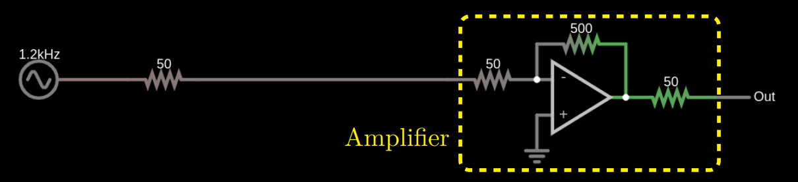
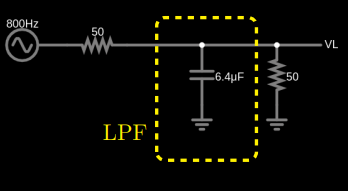

Linear Networks Analysis and Synthesis

# Lab 2 Preliminary Theoretical Work

Academic year 2023-2024

Alonso Herreros Copete 
NIA: 100493990

---

## Figures

Figure 1: FSK with a low pass filter to discriminate frequencies

Figure 2: FSK with a high pass filter to discriminate frequencies

## Session 1

Response of the original low pass filter and high pass filter

### 1.1. S1 Preparatory Homework: Characterization of the initial filters

1. Show that the impedance *seen* on the left by the low pass filter in the following figure is 50 Ω. That is,
   verify that the impedance of the following circuit is 50 Ω.

   

    What is the insertion *gain* (the inverse of the insertion loss) of the block marked *Amplifier* when we
    connect a $50$ Ω resistor at its output (node `Out`)? Write your answer in dB.

2. Obtain, by means of circuit analysis, the following properties of the low pass filter used in the circuit
    shown in the [Figure 1](#figure1):

    * Filter order.
    * Transfer function.
    * Frequency at which the filter attenuates $3$ dB.
    * Atenuación del filtro a frecuencias $f_1 = 800 \text{ Hz}$ and $f_2 = 1200 \text{ Hz}$.

    NOTE: Be aware that the filter is fed on the left side by a source with an internal impedance of $50$ Ω
    (the output impedance of the amplifier), and is loaded on its right by another impedance of $50$ Ω. That
    is, the analysis is that of the following circuit:

    

3. Repeat the previous item for the high pass filter in the circuit of Figure 2.

4. It is desired to replace the previous filter with a more selective filter. For the new filters, the
   attenuation at one the frequencies must be less than $0.5$ dB, and the attenuation at the other frequency
   must be more then $10$ dB. Plot the specification mask of the new filters and then overlay on it the
   response of the initial filters (the ones obtained in the previous items). Use a computer tool that you can
   use during the laboratory session to create this graph. (Matlab, Python, Desmos, Geogebra,...)

    During the laboratory session, you will design a low-pass filter and a high-pass filter that meets these
    specifications, characterise it experimentally, and verify that these specifica- tions are indeed met.
