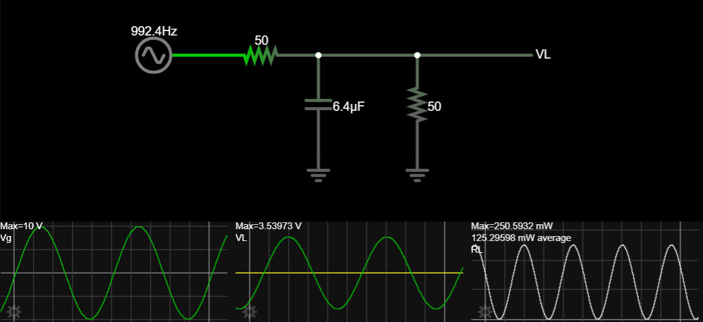
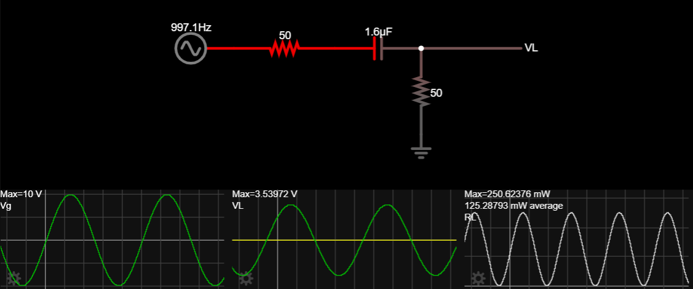
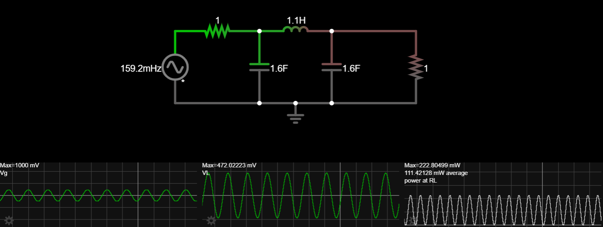
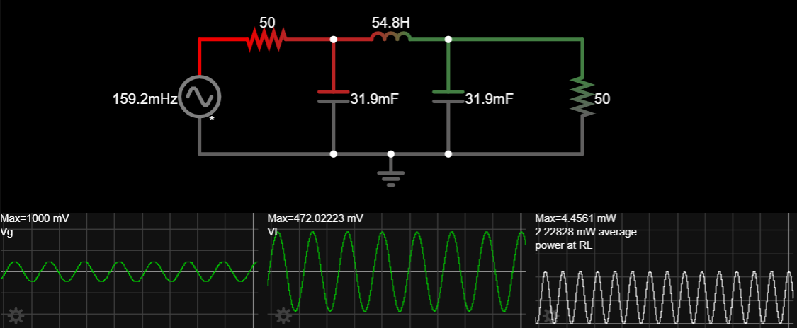
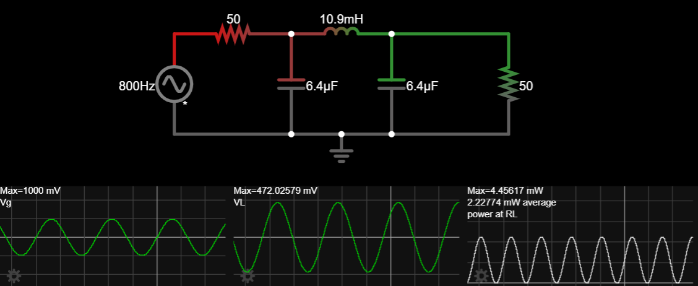
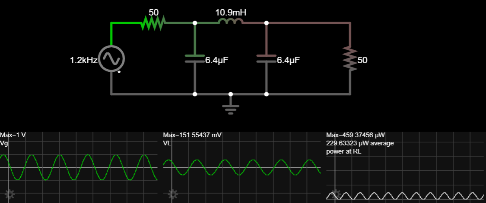
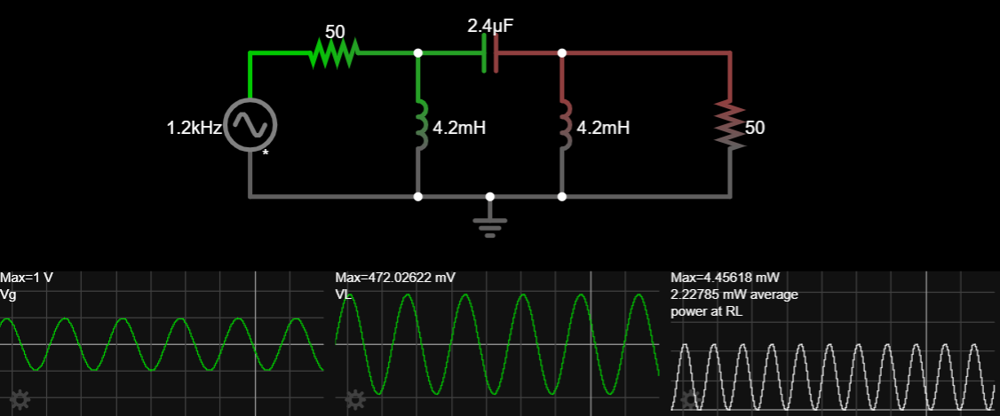
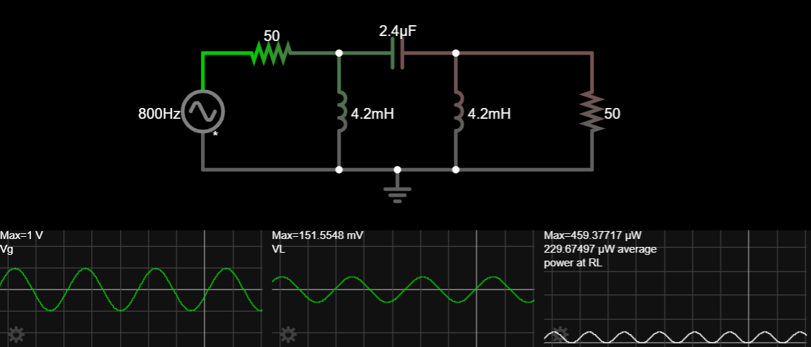

Linear Networks Analysis and Synthesis

# Lab 2 Preliminary Theoretical Work

Academic year 2023-2024

Alonso Herreros Copete 
NIA: 100493990

---

## Figures

Figure 1: FSK with a low pass filter to discriminate frequencies

Figure 2: FSK with a high pass filter to discriminate frequencies

## Session 1

Response of the original low pass filter and high pass filter

### 1.1. S1 Preparatory Homework: Characterization of the initial filters

1. Show that the impedance *seen* on the left by the low pass filter in the following figure is 50 Ω. That is,
   verify that the impedance of the following circuit is 50 Ω.

   

    What is the insertion *gain* (the inverse of the insertion loss) of the block marked *Amplifier* when we
    connect a $50$ Ω resistor at its output (node `Out`)? Write your answer in dB.

    <!-- https://tinyurl.com/4ccavhxj -->

    > The amplifier is set up with *negative feedback*, creating a *virtual short cirtuit* between its
    > positive and negative terminals. We can use one mesh equation and Ohm's Law to find the impedance seen
    > by the low pass filter.
    >
    > $$\\
    > V_g = Iᵢₙ \cdot (R_g + R₁) ⟹ Iᵢₙ = \frac{V_g}{R_g + R₁}\\
    > Vᵢₙ = V_g - Iᵢₙ R_g = Iᵢₙ R₁ ⟹ \frac{Vᵢₙ}{Iᵢₙ} = R₁ \\
    > \boxed{Zᵢₙ = \frac{Vᵢₙ}{Iᵢₙ} = R₁ = 50 Ω}
    > $$
    >
    > Then, we can find the insertion gain by calculating ratio of the power at the output of the amplifier to
    > the power transmitted without the amplifier. First, we'll find the output voltage.
    >
    > $$\\
    > Iᵢₙ = \frac{Vᵢₙ}{R_g + R₁} \\
    > Vₒᵤₜ = Iᵢₙ R₁ -Iᵢₙ (R₂ + R₃) = \frac{R₁ - R₂ - R₃}{R_g + R₁} Vᵢₙ
    > $$
    >
    > Then, the power at the output and the power without the amplifier.
    >
    > $$\\
    > P₂ = \frac{|Vₒᵤₜ|^2}{R_L} = \frac{1}{R_L} \left(\frac{R₁ - R₂ - R₃}{R_g + R₁} Vᵢₙ\right)² \\
    > P₂₀ = \frac{|V₂₀|^2}{R_L} = \frac{1}{R_L} \left(\frac{R_g}{R_g + R_L} Vᵢₙ\right)² \\
    > $$
    >
    > With that, we can find the insertion gain, which is the inverse of the insertion loss.
    >
    > $$\\
    > G_I = \frac{P₂}{P₂₀} = \left(\frac{(R_g + R_L)(R₁ - R₂ - R₃)}{(R_g + R₁) R_g}\right)² = 100
    > $$
    >
    > Finally, we can convert it to decibels the usual way.
    >
    > $$\\
    > \boxed{G_{I\,[dB]} = 10 \log |G| = 20 \text{ dB}}
    > $$

2. Obtain, by means of circuit analysis, the following properties of the low pass filter used in the circuit
    shown in the [Figure 1](#figure1):

    * Filter order.
    * Transfer function.
    * Frequency at which the filter attenuates $3$ dB.
    * Atenuación del filtro a frecuencias $f_1 = 800 \text{ Hz}$ and $f_2 = 1200 \text{ Hz}$.

    NOTE: Be aware that the filter is fed on the left side by a source with an internal impedance of $50$ Ω
    (the output impedance of the amplifier), and is loaded on its right by another impedance of $50$ Ω. That
    is, the analysis is that of the following circuit:

    

    > From simple observation that there is only one reactive element in the filter, we can assert that the
    > filter order is $\boxed{n = 1}$.
    >
    > The transfer function can be obtained using node analysis and the definition of the transfer function
    > with matched impedances, $H = 2\frac{V_L}{Vᵢₙ}$.
    >
    > $$\\
    > \frac{Vᵢₙ - V_L}{R_3} = \frac{V_L}{R_L} + sC V_L
    > ⟹ V_L = \frac{Vᵢₙ}{R₃(\frac{1}{R₃} + \frac{1}{R_L} + sC)} ⟹ \\
    > ⟹ \boxed{H(s) = 2 \frac{V_L}{Vᵢₙ} = \frac{2}{R₃(\frac1{R₃} + \frac1{R_L}+sC)} = \frac{6250}{6250+s}}
    > $$
    >
    > To find at which frequency the filter attenuates $3$ dB, we'll use the transfer function in terms of
    > frequency.
    >
    > $$\\
    > α = -10\log |H(j2πf)|² = 3 \text{ dB} ⟹ |H(j2πf)|² = 10^{-3/10} ⟹ \\
    > ⟹ \left|\frac{2}{R₃(\frac1{R₃} + \frac1{R_L}+j2πf C)}\right|² = 10^{-3/10} ⟹ \\
    > ⟹ \boxed{f = \frac{\sqrt{4⋅10^{0.3}R₃⁻² - \left(R₃⁻¹ + R_L⁻¹\right)²}}{2πC} = 992.36\text{ [Hz]}}
    > $$
    >
    > <!--
    > $$
    > 2² = 10^{-3/10} R₃² \left(\left(\frac{1}{R₃} + \frac{1}{R_L}\right)² + (2πC)²f²\right) \\
    > \frac{4⋅10^{3/10}}{R₃²} - \left(\frac{1}{R₃} + \frac{1}{R_L}\right)² = (2πC)²f² \\
    > f = \sqrt{\frac{\frac{4⋅10^{3/10}}{R₃²} - \left(\frac{1}{R₃} + \frac{1}{R_L}\right)²}{4π²C²}} = 992.36
    > $$
    > -->
    >
    > The attenuation at the given frequencies can be found by evaluating the expression of the attenuation at
    > those frequencies
    >
    > $$\\
    > α = -10\log |H(j2πf)|² = -10\log \left|\frac{2}{1 + R₃(R_L⁻¹ + j2πfC)}\right|² \\
    > \boxed{\begin{aligned}
    >     α₁ &= α|_{f=f₁=800 \text{ Hz}} &= 2.16 \text{ [dB]} \\
    >     α₂ &= α|_{f=f₂=1200 \text{ Hz}} &= 3.90 \text{ [dB]}
    > \end{aligned}}
    > $$

3. Repeat the previous item for the high pass filter in the circuit of [Figure 2](#figure2).

    > Since there is still only one reactive element, the filter order is still $\boxed{n = 1}$.
    >
    > The high pass filter can be analyzed easily as a voltage divider and the same transfer function
    > definition as before.
    >
    > $$\\
    > V_L = \frac{R_L}{R₃ + R_L + \frac{1}{sC}} Vᵢₙ = \frac{1}{1 + R_L⁻¹ (R₃ + s⁻¹C⁻¹)} Vᵢₙ ⟹ \\
    > ⟹ \boxed{H(s) = 2⋅ \frac{V_L}{Vᵢₙ} = \frac{2}{1 + R_L⁻¹ (R₃ + s⁻¹C⁻¹)} = \frac{1}{1 + 6250 s⁻¹}}
    > $$
    >
    > We'll find the frequency at which the filter attenuates $3$ dB the same way.
    >
    > $$\\
    > α_c = -10\log |H(j2πf)|² = 3 \text{ dB} ⟹ |H(j2πf)|² = 10^{-3/10} ⟹ \\
    > ⟹ \left|\frac{2}{1 + R_L⁻¹ (R₃ + (j2πf C)⁻¹)}\right|² = 10^{-3/10} ⟹ \\
    > ⟹ \boxed{f = \frac1{2πR_L C\sqrt{4⋅10^{0.3} - (1 + R_L⁻¹R₃)²}} = 997.08 \text{ [Hz]}} \\
    > $$
    >
    > <!-- 
    > $$\\
    > 2²⋅10^{0.3} = (1 + R_L⁻¹R₃)² + (2πf R_L C)⁻² \\
    > 4⋅10^{0.3} - (1 + R_L⁻¹R₃)² = (2πf R_L C)⁻² \\
    > 2πf R_L C = \frac1{\sqrt{4⋅10^{0.3} - (1 + R_L⁻¹R₃)²}} \\
    > f = \frac1{2πR_L C\sqrt{2²⋅10^{0.3} - (1 + R_L⁻¹R₃)²}} \\
    > $$
    > -->
    >
    > And finally, we'll evaluate the attenuation at the given frequencies.
    >
    > $$\\
    > α = -10\log |H(j2πf)|² = -10\log \left|\frac{2}{1 + R_L⁻¹ (R₃ + (j2πf C)⁻¹)}\right|² \\
    > \boxed{\begin{aligned}
    >     α₁ &= α|_{f=f₁=800 \text{ Hz}} &= 4.06 \text{ [dB]} \\
    >     α₂ &= α|_{f=f₂=1200 \text{ Hz}} &= 2.27 \text{ [dB]}
    > \end{aligned}}
    > $$

4. It is desired to replace the previous filter with a more selective filter. For the new filters, the
   attenuation at one the frequencies must be less than $0.5$ dB, and the attenuation at the other frequency
   must be more then $10$ dB. Plot the specification mask of the new filters and then overlay on it the
   response of the initial filters (the ones obtained in the previous items). Use a computer tool that you can
   use during the laboratory session to create this graph. (Matlab, Python, Desmos, Geogebra,...)

    During the laboratory session, you will design a low-pass filter and a high-pass filter that meets these
    specifications, characterise it experimentally, and verify that these specifications are indeed met.

    > The plots were made in Python.
    >
    > 
    > 

    >     Figure 1.1.4.1: Specification mask for the requested low-pass filter and current low-pass filter
    >     response
    > 

    >
    > 
    > 

    >     Figure 1.1.4.2: Specification mask for the requested high-pass filter and current high-pass filter
    >     response
    > 

### 1.2. S1 Lab work: Design and characterization of a new low-pass filter

1. Check the results obtained in the previous work using the Falstad simulator

    > The theoretically calculated frequencies were checked by recreating the circuit in Falstad and
    > setting the input frequency to this value. The power values were taken from the average power
    > measurement. If the power at the output is half the max power (or $10^{-0.3}$ times, to be exact),
    > then the theoretical frequency is considered to be correct.
    >
    > $$
    > Pₘₐₓ = \frac{|V_g|²}{8⋅R_g} = 0.25 \text{ [W]} \\
    > P₂ = Pₘₐₓ ⋅ 10^{-3/10} = 0.1253 \text{ [W]}
    > $$

    * (a) Check, by means of a Falstad simulation, the value of the frequency at which the low pass filter
      characterized in the previous work attenuates 3 dB. Take a screenshot of your measurement and explain
      how you have verified the result.

        > For the low-pass filter, the frequency was found to be $992.36 \text{ Hz}$. The Falstad simulator
        > proved this to be correct, as seen in the following screenshots (link to Falstad in the images).
        >
        > 
        > 

        > Figure 1.2.1.a: Falstad simulation of the low-pass filter at the theoretically calculated frequency
        > 

        >
        > As the screenshot shows, the average power is $125.3 \text{ mW}$, just as expected.

    * (b) Same as in the previous section, but with the high pass filter.

        > In the case of the high-pass filter, the frequency was found to be $997.08 \text{ Hz}$. The Falstad
        > simulator showed the following results:
        >
        > 
        > 

        > Figure 1.2.1.b: Falstad simulation of the high-pass filter at the theoretically calculated frequency
        > 

        >
        > Again, the average power was $125.3 \text{ mW}$, confirming the theoretical frequency.

2. Design the low pass filter whose specification mask you have obtained in the preparatory work.
    * (a) Determine the type and order of the approximation to be used.

        > First, we'll find the selectivity and discrimination factors.
        > $$
        > K_S = \frac{f_p}{f_a} = \frac{800}{1200} = \frac{2}{3} \\
        > K_D = \sqrt{\frac{10^{α_p/10} - 1}{10^{α_a/10} - 1}} = 0.1164
        > $$
        >
        > Now, we'll compare the order required for Butterworth and Chebyshev filters.
        >
        > * For Butterworth: $n ≥ \frac{\log(K_D)}{\log(K_S)} = 5.3$
        > * For Chebyshev: $n ≥ \frac{\cosh⁻¹(\frac{1}{K_D})}{\cosh⁻¹(\frac{1}{K_S})} = 2.95$
        >
        > We'll use Chebyshev filter approximation of order $3$.

    * (b) Obtain the filter implementation (take screenshots and explain the mesurements at each step):
        * Select a prototype of the tables. Check the prototype response at $\bar{ω} = 1 \text{ rad/s}$. In
          order to display such low frequency signals, you will need to increase the value of the `Time step
          size` in `Other options`. (In general this parameter should be between 100 and 10000 times smaller
          than the period of the signal).

        > We'll use the following prototype table for the Chebyshev filter, defined for $ωₚ=1$, $αₚ=0.5
        > \text{ dB}$, $ε²=0.122$, $|ρ|ₚ=-9.6 \text{ dB}$:
        >
        > | $n$ |   $g₀$   |   $g₁$   |   $g₂$   |   $g₃$   |   $g₄$   |
        > | :-: | :------: | :------: | :------: | :------: | :------: |
        > | $1$ | $1.0000$ | $1.5963$ | $1.0967$ | $1.5963$ | $1.0000$ |
        >
        > The circuit was modeled in Falstad and the response was measured at the given frequency ($f =
        > \frac{1}{2π} \text{ Hz}$) and input amplitude $V_g = 1 \text{ V}$, comparing the average
        > simulated power with the calculated power according to the prototype parameters. We are
        > expecting to find $P₂$ at the load.
        >
        > $$
        > Pₘₐₓ = \frac{|V_g|²}{8⋅R_g} = 0.125 \text{ [W]} \\
        > P₂ = Pₘₐₓ ⋅ 10^{-0.5/10} = 0.1114 \text{ [W]}
        > $$
        >
        > As we compare these values to the ones in Figure 1.2.2.b.1, we can see that the filter is
        > correctly designed.
        >
        > 
        > 

        > Figure 1.2.2.b.1: Falstad simulation of the normalized Chebyshev filter at the prototype frequency
        > 

        * Denormalise impedances and check that the transfer function does not change. Do the voltages change?
          And the currents?

        > The impedance denormalization was done by applying the following transformation to the circuit in
        > order to turn the 1 Ω resistors into the desired 50 Ω resistors, using the normalization factor $Rₙ
        > = 50$.
        >
        > $$
        > \begin{cases}
        >     R → Rₙ R \\
        >     L → Rₙ L \\
        >     C → \tfrac{C}{Rₙ} \\
        > \end{cases}
        > $$
        >
        > The new values can be seen in the Falstad simulation screenshot (Figure 1.2.2.b.2). The voltages
        > remain the same, but the currents change, and so does the power. This is expected from impedance
        > normalization. Furthermore, even if some values change, the power and current ratios remain the
        > same. We can conclude that **the transfer function stays the same**
        >
        > 
        > 

        > Figure 1.2.2.b.2: Falstad simulation of the impedance-denormalized Chebyshev filter
        > 

        * Apply the denormalisation on the frequency axis to the circuit, and check that the measurement does
          not change if it is now measured at the corresponding scaled frequency. (Do not forget to reset the
          `Time step size`.) Use a normalization frequency that allows you to meet specifications loosely in
          both the passband and the attenuated band.

        > In order to apply frequency denormalization, we'll use the normalization factor $ωₙ = 1600π \text{
        > rad/s}$ (for $f = 800 \text{ Hz}$), which is the frequency at which we want the new filter to have
        > the attenuation that is currently at $ω = 1 \text{ rad/s}$ (attenuation $α = 0.5 \text{ dB}$). The
        > transformation is as follows:
        >
        > $$
        > \begin{cases}
        >     L → \frac{L}{ωₙ} \\
        >     C → \frac{C}{ωₙ} \\
        > \end{cases}
        > $$
        >
        > As before, the final values can be seen in the Falstad simulation screenshot (Figure 1.2.2.b.3). The
        > simulation was adjusted to the new frequency, and the response was checked correctly: as seen in the
        > screenshot, all values are now the same at the target frequency.
        >
        > 
        > 

        > Figure 1.2.2.b.3: Falstad simulation of the denormalized Chebyshev filter
        > 

3. Use low-pass to high-pass transformation $s = \frac{ω₀²}{p}$ to transform the low pass filter designed in
   the previous section into a high pass filter whose attenuation at $800 \text{ Hz}$ and $1200 \text{ Hz}$
   match the attenuation of the low pass filter at $800 \text{ Hz}$ and $1200 \text{ Hz}$ respectively. Obtain
   the high pass filter and verify the requirements.

    > The frequency $ωₚ$ will be moved from $2π⋅800 \text{ rad/s}$ to $2π⋅1200 \text{ rad/s}$, while the
    > atttenuation values will be kept the same. Both frequencies, $fₐ = 800 \text{ Hz}$ and $fₚ = 1200 \text{
    > Hz}$, will be simulated in Falstad to check the filter response and checked against the corresponding
    > frequencies in the low-pass filter. First, we'll check the low-pass filter output power at $800 \text{
    > Hz}$:
    >
    > 
    > 

    > Figure 1.2.3.0: Low-pass filter response at $1200 \text{ Hz}$
    > 

    >
    > We got a value close to $229.63 \text{ μW}$. Next, we'll design the new filter. The lowpass-highpass
    > transformation is as follows:
    >
    > $$
    > ω₀ = \sqrt{ωₚ ωₚ'} = 2π⋅\sqrt{960000} \\
    > \begin{cases}
    >     L → C' = \frac{1}{ω₀² L} \\
    >     C → L' = \frac{1}{ω₀² C} \\
    > \end{cases}
    > $$
    >
    > This means swapping capacitors for inductors and vice-versa. The new circuit and values can be seen in
    > the Falstad simulation screenshot (Figure 1.2.3.1). We'll check the power values against those obtained
    > with the low-pass filter.
    >
    > 
    > 

    > Figure 1.2.3.1: Falstad simulation of the high-pass filter at 1200 Hz
    > 

    >
    > This power value of $2.2278 \text{ mW}$ is essentially the same as the one obtained with the low-pass
    > filter at $800 \text{ Hz}$ (close to $2.2278 \text{ mW}$ as well), as expected. We'll now check the
    > power at $800 \text{ Hz}$:
    >
    > 
    > 

    > Figure 1.2.3.2: Falstad simulation of the high-pass filter at 800 Hz
    > 

    >
    > As before, this power value $229.67 \text{ μW}$ is essentially the same as the one obtained with the
    > low-pass filter at $1200 \text{ Hz}$ (close to $229.63 \text{ μW}$), confirming the correct design of
    > the high-pass filter.

4. Calculate and plot on the specification mask the amplitude response of the original low- pass filter and
   high-pass filters, and the new designed low-pass filter and high-pass filters(to make this plot, use the
   computer procedure you had to prepare in the preliminary work).

5. Characterise the designed filters (Low-pass and high-pass) using the circuit simulator, taking measurements
   of the filter response (**only in modulus**) at significant points on the frequency axis. Add the
   measurements to the plot made in the previous paragraph and check the correspondence. Note that since you
   are using a simulator, you can measure several frequencies simultaneously. Simply copy and paste the
   circuit. Do not forget to include the screenshots.

6. Use the filters that you have just designed in the circuit shown [here][circuit_1.2.6], where the symbols
   transmitted in an FSK signal are detected by comparing the output of the high pass filter and the low pass
   filter.
    * Compare the result obtained at nodes `FL` and `FH` with the original filters and the new filters.
      Explain the result.
    * Compare the result obtained in the `RX signal` node. Explain the result.

[circuit_1.2.6]:
https://www.falstad.com/circuit/circuitjs.html?ctz=CQAgjCAMB0l3BWcAWAbNAHJMCDMCxUB2DDAJg1RD2usmoFMBaMMAKACUQzl78zwqPggH0IWMVCkwEnbr25EBhemSVSIYMnHBTc0MMhwBOMqjwIMxosdxRoslSGS4BrvrirvpB8PH-wbADuILiQyIpunqHhUMExEfyh0bjRkGxgpNxZLm7azq5+fmKuqFYICKhUTMYIaHBaVAjGrJCkREgY8bgYEWiJvclU6VwUGAUCPPS5upM6ZA7ci-Qy8TPezXkrbABO8qrqYRFqonS7+6EiCZenCOnaRKGD-RPOqH0gAEIAlgB2AIY7ACeAB0AM5g74AcwBABs2ABjPwKMCmcBaMRolawfyEULQXBEOAYMBEFw4QktOJ7VhXVHKHCTSpSO5sKEgDCFJKctyDbb-Dlc6ItKJUcY4EAsJBgAL0JgwXGeVKosCpZBYIio8ZiALnHnZcYig0suDxfVjQVbOIhI0Wo2pYbxVVo7Ti5DM11xJHOubi3Au5nY-zNYyhsPh8NIGBEyBkBBEYjhQzIMyPBXYNngf1Mqg+yLSTN5mZF9UF73Zp4RIuFIPwEMRhuh6XQMwy2wUYwYESEYz2BpOis9Kvurx8tgAEyzFG4bSzLtnAnHDAAZv8AK6wgAu51pbjK6KuM3orO9kEO+5l6iPff873A0DKd14GE18bK5Cj51M4rRMtn9JNHdiVCfdvxA7UzhCP9xk8cUzz3bUnXg8CDwQ610XyADd3ALEkP-X9wkxURC2Q4tSNLbZ2Ww4tGWcCi4io2i41zJj1H5cAeHGT1VWnT1ewlKVin8SUwBxVJNTUVgyB6MgIBYMSelVcJOXMVw7D-QIoNcLj-207hAwHXjmS0UtmPQkyuJ4DjTIMqDaKw7QiPM2jYI4nRXPSKDOOcHQLNeTyp3GYtvKPQyYMGHigprNgBT8odAsrEB+KQQSNPge9H1jXhZIdKpfwfLtCJfHAE1IOMhNNSdIsSvN4sXFd1y3PUuXyDorWPALNlCVqrm8AL7WFacHXQsDhtG-d+qGwaf2I2Kn2NHBBgtcURIqnRozgOMEyJIxkBTYh71bSB2ysLtZNQfjdQeV5vBmKZnBAAAxABlABpNhroxJyvpQD5HoACQ+s9wHm7j5uTB6AAV2E++b4pwWJkGMKgIkhsggceH7XKx-IIkegAZDGQaWrJCEKC0Ig4AANcFIRhf54Sg0H-1BtinThiK4didIaRHGq+evVkqIFwpDGZPaIPSYWPWMvmTgLXmPX-OXA0glAlfFZnEKZ2J4b5+L0gAI2KN0q0MVQriNk2hnRf1nE1OIAA8-B6LNpTaXNXeOCJ-shx62GdmV3WoGU-CsEO7G9kB8b9p1HJw5RvIAgKsYvbyPLYY2tEMcB1EMYxVGRuIs9kx5cDQFBbHt7ZA7INEkcxlxHjuaZwHGABRX4ADcGFhAB7AAHBhwSXTcGARTc+52AOOJfEHc2LZoHsyEBO57-uh5Hhgx4nqe2CAA
