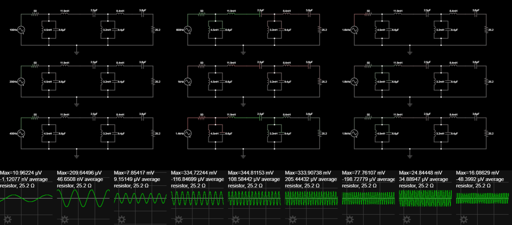
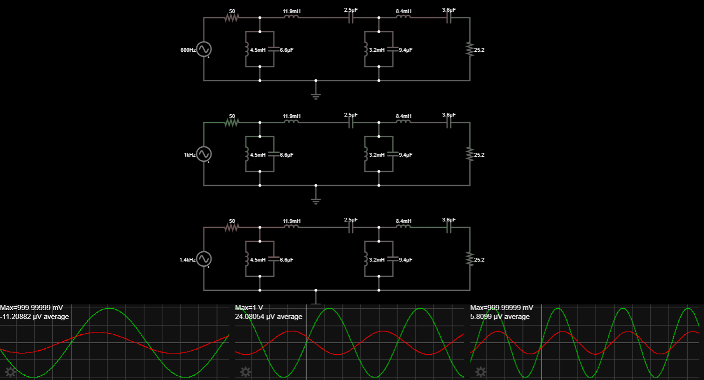
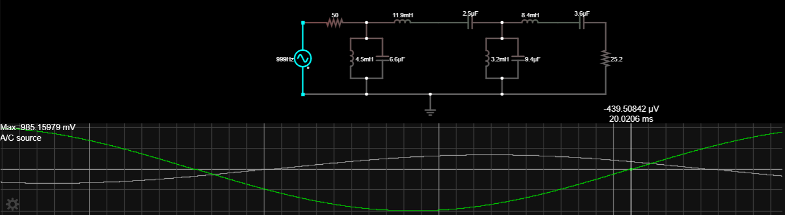
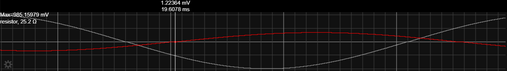
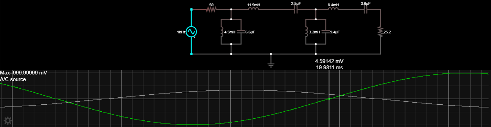
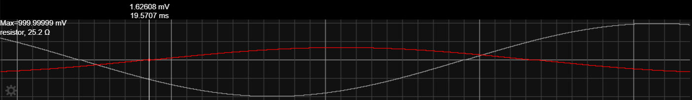
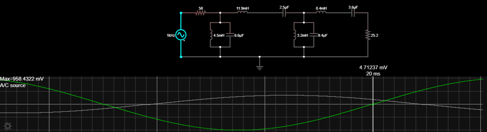
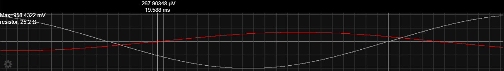

Linear Networks Analysis and Synthesis

# Lab 2. May 2024

<strong>FULL NAME</strong>: Alonso Herreros Copete 
<strong>NIA</strong>: 100493990

<strong>DATE AND TIME</strong>: 08/05/2024, 13:05 PM 
<strong>ROOM</strong>: 4.1.E05

---

## Session 2

Design and characterization of a bandpass filter

### 1. AMPLITUDE response of the designed bandpass filter

Obtain the **modulus** of the frequency response of the designed bandpass filter. To do this you must make
measurements with the circuit simulator. The frequencies chosen to characterize the filter should allow to
verify that the filter response in amplitude meets the specifications. Compare the obtained measurements with
the expected theoretical result.

<!--
* [x] Insert screenshot(s) here 
* [x] Results, explanations and comments
* [x] Table/graph of measurements and thxoretical values
* [x] Optional: Insert link to the designed circuit in Falstad (this can be done in all answers)
-->

> 9 different frequencies were tested at once, captured, tabulated and processed to get the amplitude response
> of the bandpass filter.
>
> 
>
> Table:
>
> | $f$ (Hz) |       $V (V)$        | $H$ (V/V) |
> | :------: | :------------------: | :-------: |
> | $100.0$  | $10.962 \text{ μV}$  | $0.0000$  |
> | $200.0$  | $209.645 \text{ μV}$ | $0.0006$  |
> | $400.0$  |  $7.854 \text{ mV}$  |  $0.02$   |
> | $600.0$  | $334.722 \text{ mV}$ |  $0.94$   |
> | $1000.0$ | $344.907 \text{ mV}$ |  $0.97$   |
> | $1400.0$ | $333.907 \text{ mV}$ |  $0.94$   |
> | $1600.0$ | $77.761 \text{ mV}$  |  $0.22$   |
> | $1800.0$ | $24.844 \text{ mV}$  |  $0.07$   |
> | $1900.0$ | $16.086 \text{ mV}$  |  $0.05$   |
>
> This is as expected. A loss of 0.5 dB corresponds to a factor of about $0.89$, while the attenuations of $20
> \text{ dB}$ and $30 \text{ dB}$ are approximately $0.1$ and $0.001$ respectively, which is consistent with
> these measurements. In all cases, the measured values are within the specifications.

### 2. PHASE response of the designed bandpass filter

Now make the necessary measurements to obtain the **phase** response, but only of the passband (the center of
the passband and two more frequency points are enough).

<!--
* [x] Insert screenshot(s) here
* [x] Results, explanations and comments
* [x] Table/graph of measurements and theoretical values
-->

> Measurements were taken 3 at once, taking the point $t = 10 \text{ ms}$ as a reference, since all 3 input
> signals crossed the horizontal axis at this point. The input and output voltages were overlapped in the
> scopes to better measure the phase difference, and inspected by hovering the mouse at the points where the
> output signals cross the horizontal axis.
>
> 
>
> After tabulating the time differences, the phase differences were calculated using the formula:
>
> $$
> Δφ = 2πfΔt
> $$
>
> | $f$ (Hz) | $T$ (s)            | $Δt$ (s)          | $Δφ$ (rad) |
> | :------- | :----------------- | :---------------- | :--------: |
> | $600$    | $1.667 \text{ ms}$ | $-132 \text{ μs}$ |  $-0.498$  |
> | $1000$   | $1 \text{ ms}$     | $-409 \text{ μs}$ |  $-2.551$  |
> | $14000$  | $714.3 \text{ ms}$ | $53 \text{ μs}$   |  $0.466$   |
>
> No theoretical values were calculated in the preparatory work.

### 3. Group delay

Estimate the group delay at the center frequency of the bandpass filter.

<!--
* [x] Explain the estimation/measurement method
* [x] Result:
-->

> The group delay was estimated using the corresponding formula:
>
> $$
> τ_d = - \frac{d \arg\{H(ω)\}}{d ω}
> $$
>
> In order to find this value at the center of the bandpass filter, two close frequencies were chosen around
> the center frequency, and the phases were measured using the method described in the previous section. The
> group delay was then estimated by calculating the slope of the phase response at the center frequency. In
> order to take more accurate measurements, the measurements were done one at a time, with a time scale
> allowing for greater resolution, and at around $t = 20 \text{ ms}$
>
> 
> 
>
> 
> 
>
>
> | $f$ (Hz) | $ω$ (rad/s)   | $Δt$ (s)            | $Δφ$ (rad) |
> | :------- | :------------ | :------------------ | :--------: |
> | $999$    | $ω₁ = 1998 π$ | $-412.8 \text{ μs}$ | $-2.5911$  |
> | $1001$   | $ω₂ = 2002 π$ | $-410.4 \text{ μs}$ | $-2.5812$  |
>
> <!-- Middle measurement, not used
> 
> 
> | $1000$   | $2000 π$    | $-412.0 \text{ μs}$ | $-2.5887$  |
> -->
>
> With these values, we can take use the following modified formula to calculate the group delay:
>
> $$
> \boxed{τ_d ≈ \frac{φ₂ - φ₁}{ω₂ - ω₁} = -7.884 ⋅ 10^{-4} \text{ s}}
> $$

### 4. Effect of noise WITHOUT the bandpass filter

Study the effect of adding noise to the FSK signal in the system with the low pass and high pass filters that
you designed in the first session, but **without** the band-pass filter you just designed (complete the
circuit for this [link](https://tinyurl.com/29qgxltj)):

* Determine, by progressively increasing the amplitude of the noise, what is the maximum noise level at which
  the signal is no longer correctly detected at the node `RX signal`.

    <!--
    * [ ] Insert screenshot(s) here
    * [ ] Result and explanation/comment
    -->

    * Suppose now that you use the envelope of the output of the high pass filter to determine the symbol that
  arrives at it (node `P1`). What would be the maximum noise level at which it would be possible to recover,
  with few errors, the transmitted data?

    <!--
    * [ ] Insert screenshot(s) here
    * [ ] Result and explanation/comment
    -->

    * Suppose now that you use the envelope of the output of the low-pass filter to determine the symbol that
  arrives at it (node P2). What would be the maximum noise level at which it would be possible to recover,
  with few errors, the transmitted data?

    <!--
    * [ ] Insert screenshot(s) here
    * [ ] Result and explanation/comment
    -->

    NOTE: Try to explain the different noise levels obtained

### 5. Effect of noise WITH the bandpass filter
Now add the band pass filter to the system (complete the circuit of this
[link](https://tinyurl.com/2yxxu5f5)):

* What is the delay of the received data signal RX signal with respect to the original **binary signal**?
  Relate the result with the phase response of the bandpass filter studied in sections 2 and 3. Insert
  screenshot(s) here Results and explanations/comments

    <!--
    * [ ] Insert screenshot(s) here
    * [ ] Result and explanation/comment
    -->

* Repeat section 4 and compare the results. Draw conclusions about the effectiveness of the bandpass filter in
  limiting the effect of noise. Insert screenshot(s) here Results and explanations/comments

    <!--
    * [ ] Insert screenshot(s) here
    * [ ] Result and explanation/comment
    -->
